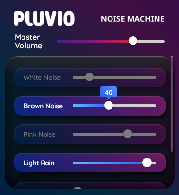

# Pluvio - a simple desktop rainbox 🎶

**Pluvio** from the word *Pluviophile* [ˈplu vi əˌfaɪl ] or "rain-lover" is a lightweight desktop noise machine.

Whether you're a developer looking for a productivity boost, a student needing focus, or someone who just wants to unwind, Pluvio has you covered.

---

## Features ✨

### 🌧️ **Nature Sounds**
- Play high-quality rain sounds on loop to create a calming atmosphere.
- Perfect for relaxation, meditation, or sleep.

### 🎛️ **Noise Generators**
- Choose from **white noise**, **brown noise**, and **pink noise** to mask distractions and improve focus.
- Scientifically designed to enhance concentration and relaxation.

### 🎨 **Beautiful and Simple Interface**
- Clean, intuitive design that makes it easy to use.
- Tracks are clearly labeled and organized for quick access.

### ⚡ **Lightweight and Fast**
- Built with **Rust** and **Tauri** for blazing-fast performance and minimal resource usage.
- No bloat, no ads—just pure audio bliss.

---

## Why Use Pluvio? ❓

### For Productivity 🚀
- Block out distractions with customizable noise tracks.
- Stay in the zone with a consistent audio environment.

### For Relaxation 🌿
- Create a calming atmosphere with rain sounds and ambient noise.
- Perfect for meditation, yoga, or winding down after a long day.

### For Sleep 😴
- Drift off to sleep with soothing sounds and customizable loops.
- Wake up refreshed and ready to tackle the day.

### For Developers 💻
- Built with modern technologies like **Rust**, **Tauri**, and **Svelte**.
- Open-source and extensible—contribute or customize to your heart's content.

---

## Screenshots 🖼️

  
*The clean and intuitive interface of Pluvio.*

---

## Installation 📥

1. Go to [Releases](https://github.com/signet-marigold/Pluvio/releases)
2. Download the executable that matches your operating system

**`.exe`**, **`.msi`** for Microsoft Windows  
**`.deb`** for Debian based systems (e.g. Ubuntu, Debian, Linux Mint, Deepin, etc.)  
**`.rpm`** for RPM based systems (e.g. Fedora Linux, openSUSE, Red Hat Linux, Red Hat Enterprise Linux, etc.)  
**`.AppImage`** for all Linux distros  

3. Install

- Windows, .exe and .msi

1. Double click the downloaded file
2. Windows may promt you with a "Windows protected your PC" screen.
If that happens click `More info` then `Run anyway`
3. Follow the installation wizard

---

- .deb

```
sudo dpkg -i Pluvio_0.1.0_amd64.deb
```

---

- .rpm

```
sudo rpm -i Pluvio-0.1.0-1.x86_64.rpm
```

---

- .AppImage

Move `Pluvio_0.1.0_amd64.AppImage` to a secure place in your files. This is NOT an installation file. This is the whole application.

Double click on the downloaded file

---

- NixOS

I've written a flake

You can find instructions for that here: [Pluvio Flake](https://github.com/signet-marigold/pluvio-flake)

## Uninstall 🗑️

- Windows, Uninstall .exe and .msi

1. Select Start 🪟 > Settings ⚙️ > Apps > Installed Apps ☰.
2. Find Pluvio, select More 𓈓 > Uninstall.

---

- Uninstall .deb

```
sudo dpkg –purge Pluvio
```

---

- Uninstall .rpm

```
sudo rpm -e Pluvio
```

---

- Uninstall .AppImage

Find where you are keeping the AppImage file

Move the file to trash or delete it from your filesystem

## Building 🛠️

### Prerequisites
- **Rust**: Install Rust from [rustup.rs](https://rustup.rs/).
- **NodeJS**: Install NodeJS from [nodejs.org](https://nodejs.org/).
- **PNPm**: Install PNPm from [pnpm.io](https://pnpm.io/).

#### Packaging 📦

How to build on your machine

##### Steps
1. Clone the repository:
   ```bash
   git clone https://github.com/signet-marigold/Pluvio.git
   cd Pluvio
   ```
2. Install dependencies:
   ```bash
   pnpm install
   ```
3. Build and run the app:
   ```bash
   pnpm run tauri build
   ```

Packaged executables are located in `<root>/src-tauri/target/release/bundle/`

> [!NOTE]
> If you are curious about how to install on your machine or don't wish to build from source: follow [Installation](https://github.com/signet-marigold/Pluvio?tab=readme-ov-file#installation-)

#### Development 🏗️

If you wish to add features, Test in a live environment

##### Steps
1. Clone the repository:
   ```bash
   git clone https://github.com/signet-marigold/Pluvio.git
   cd Pluvio
   ```
2. Install dependencies:
   ```bash
   pnpm install
   ```
3. Build and run the app:
   ```bash
   pnpm run tauri dev
   ```

---

## License 📜

Pluvio is open-source software licensed under the **MIT License**. See the [LICENSE](LICENSE) file for details.

---

## Support the Project 💖

If you love Pluvio, consider supporting its development:
- **Star the repo** ⭐️
- **Share with friends** 🚀
- **Contribute code or ideas** 🛠️

---
