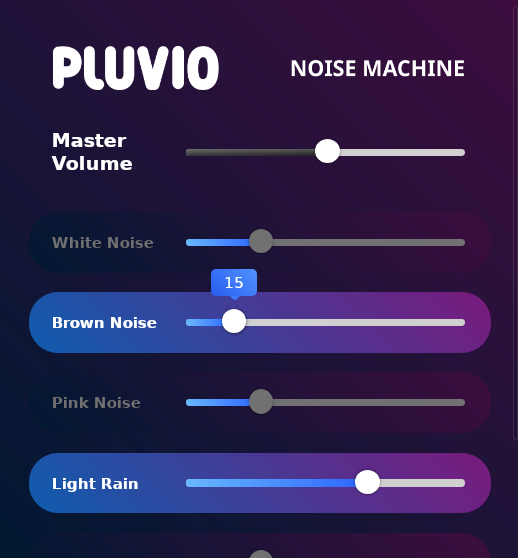

# Pluvio - a simple desktop rainbox 🎶

**Pluvio** from the word *Pluviophile* [ˈplu vi əˌfaɪl ] or "rain-lover" is a lightweight desktop noise machine.

Whether you're a developer looking for a productivity boost, a student needing focus, or someone who just wants to unwind, Pluvio has you covered.

---

## Features ✨

### 🌧️ **Nature Sounds**
- Play high-quality rain sounds on loop to create a calming atmosphere.
- Perfect for relaxation, meditation, or sleep.

### 🎛️ **Noise Generators**
- Choose from **white noise**, **brown noise**, and **pink noise** to mask distractions and improve focus.
- Scientifically designed to enhance concentration and relaxation.

### 🎨 **Beautiful and Simple Interface**
- Clean, intuitive design that makes it easy to use.
- Tracks are clearly labeled and organized for quick access.

### ⚡ **Lightweight and Fast**
- Built with **Rust** and **Tauri** for blazing-fast performance and minimal resource usage.
- No bloat, no ads—just pure audio bliss.

---

## Why Use Pluvio? 🚀

### For Productivity 🚀
- Block out distractions with customizable noise tracks.
- Stay in the zone with a consistent audio environment.

### For Relaxation 🌿
- Create a calming atmosphere with rain sounds and ambient noise.
- Perfect for meditation, yoga, or winding down after a long day.

### For Sleep 😴
- Drift off to sleep with soothing sounds and customizable loops.
- Wake up refreshed and ready to tackle the day.

### For Developers 💻
- Built with modern technologies like **Rust**, **Tauri**, and **Svelte**.
- Open-source and extensible—contribute or customize to your heart's content.

---

## Screenshots 🖼️

  
*The clean and intuitive interface of Pluvio.*

---

## Installation 🛠️

### Prerequisites
- **Rust**: Install Rust from [rustup.rs](https://rustup.rs/).
- **Bun**: Install Bun from [bun.sh](https://bun.sh/).

### Steps
1. Clone the repository:
   ```bash
   git clone https://github.com/signet-marigold/Pluvio.git
   cd Pluvio
   ```
2. Install dependencies:
   ```bash
   bun install
   ```
3. Build and run the app:
   ```bash
   bun run tauri dev
   ```

---

## License 📜

Pluvio is open-source software licensed under the **MIT License**. See the [LICENSE](LICENSE) file for details.

---

## Support the Project 💖

If you love Pluvio, consider supporting its development:
- **Star the repo** ⭐️
- **Share with friends** 🚀
- **Contribute code or ideas** 🛠️

---
